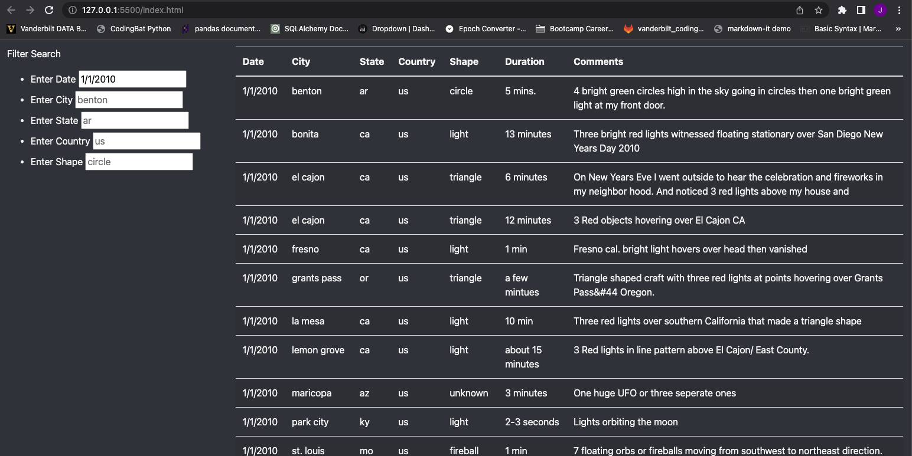
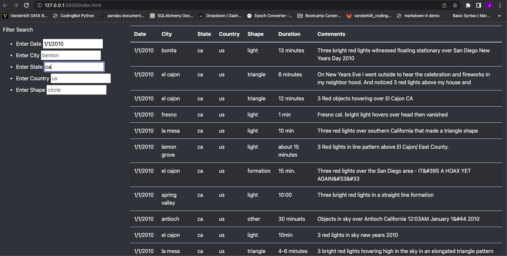
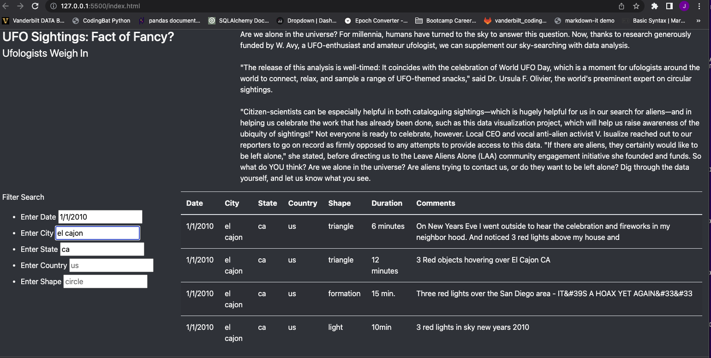
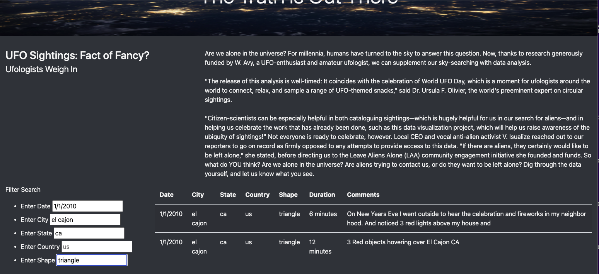

# UFO Analysis

## Overview 

 - This analysis adds functionality to a JavaScript app that allows for more granular filtering and more in-depth analysis of UFO sightings. 
 - Using JavaScript allows for dynamic presentation of the data using multiple filters.
 - Finally, the JavaScript app is integrated with HTML making the data anlysis and visualization available online. 
    - This HTML file also uses CSS and Bootstrap styling. 
- This analysis gives a basic walkthrough of the filter functionality accompanied with images.

## Results

- The JavaScript app enables users to filter the UFO sighting datay by Date, City, State, Country, and Shape of the UFO. 
    - A user can add single parameters iteratively filtering the data.

### Filtering Examples

- Note that a user can input as many filters as desired yielding more granular results as they add more filters. 

- Entering a particular Date yields all of the results in the data with that particular date:

- Users can narrow those results by adding the State filter:

- Adding the City filter narrows the results to the sightings that occurred in that city and state on that particular date:

- Finally, if a user has particular interest in a specific form of UFO sighting, that user can add a Shape filter, further narrowing results:

## Summary

- One drawback of this app is that it requires some familiarity with the data to know how to appropriately enter filters.
    - For example, the user needs to know that the data is limited to dates in January, 2010 and that El Cajon, CA is an available city in the data.
- A better design could be dropdown menus that display options from which a user can choose to filter the data.

